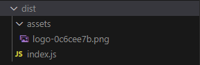

[](https://www.npmjs.com/package/rollup-plugin-external-assets)
[](https://www.npmjs.com/package/rollup-plugin-external-assets)
[](https://github.com/recursive-beast/rollup-plugin-external-assets/actions/workflows/build.yml)
[](https://codecov.io/gh/recursive-beast/rollup-plugin-external-assets)
[](LICENSE)

# rollup-plugin-external-assets

> A rollup plugin to make assets external but include them in the output.

## Installation

Via [npm](https://npmjs.org)

```sh
npm install --save-dev rollup-plugin-external-assets
```

Via [yarn](https://yarnpkg.com)

```sh
yarn add -D rollup-plugin-external-assets
```

## Usage

Assuming a `src/index.js` exists and contains code like the following:

```js
import logo from "../assets/logo.png";

console.log(logo);
```

Create a `rollup.config.js` [configuration file](https://www.rollupjs.org/guide/en/#configuration-files) and import the plugin:

```js
import { externalAssets } from "rollup-plugin-external-assets";

export default {
	input: "src/index.js",
	output: {
		file: "dist/index.js",
		format: "cjs",
	},
	plugins: [externalAssets("assets/*")],
};
```

Then call `rollup` either via the [CLI](https://www.rollupjs.org/guide/en/#command-line-reference) or the [API](https://www.rollupjs.org/guide/en/#javascript-api).

Once the bundle is executed, you end up with a `dist` directory like the following:



With `dist/index.js` containing:

```js
"use strict";

var logo = require("./assets/logo-0c6cee7b.png");
console.log(logo);
```

## Options

To tailor the plugin behavior to your needs, you can pass a configuration object as the argument:

`include`

• Type: `string | RegExp | (string | RegExp)[]`

A pattern, or array of patterns, to match files the plugin should operate on.

`exclude`

• Type: `string | RegExp | (string | RegExp)[]`

A pattern, or array of patterns, to match files the plugin should ignore.

`resolve`

• Type: `string`<br/>
• Default: `process.cwd()`

The value will be used as the base directory for resolving patterns.

## Contributing

### Prerequisites

-   [nodejs](https://nodejs.org)
-   [npm](https://npmjs.org)

### Getting Started

After cloning this repo, ensure dependencies are installed by running:

```sh
npm install
```

Then to build the final bundle:

```sh
npm run build
```

### Tests

To run tests:

```sh
npm test
```

To run tests with coverage report:

```sh
npm run test:coverage
```

Coverage report is located in `tests/coverage`.

### Commiting changes

Please follow the [conventional commits](https://www.conventionalcommits.org) specification, because [semantic-release](https://github.com/semantic-release/semantic-release) is used to automate the whole package release workflow including: determining the next version number, generating the release notes and publishing the package.

## License

[MIT](LICENSE)
